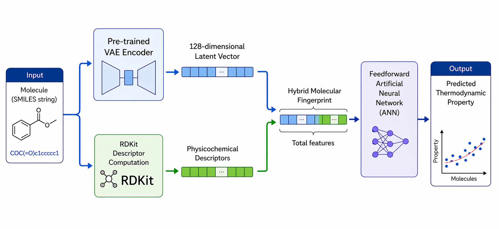

# Hybrid Molecular Representation Combining Variational Autoencoder Latent Space and Physicochemical Descriptors for the Prediction of Standard Enthalpy of Formation and Standard Entropy

## Abstract

We introduce a hybrid molecular representation framework that couples **Variational Autoencoder (VAE)** latent vectors with physicochemical descriptors computed with the **RDKit** cheminformatics library to predict two fundamental gas-phase thermodynamic properties: the standard enthalpy of formation and the standard entropy.

The VAE is trained on a corpus of **53 895 SMILES strings** under a purely reconstructive objective, yielding a **128-dimensional latent embedding** that encodes molecular structure without any exposure to thermodynamic labels. This learned representation is concatenated with a curated set of physicochemical descriptors to form a **hybrid molecular fingerprint**, which is then supplied as input to a feedforward artificial neural network for property prediction.

The proposed model achieves:
- **R² = 0.9993** and **MAE = 5.98 kJ·mol⁻¹** for the standard enthalpy of formation
- **R² = 0.9955** and **MAE = 3.70 J·mol⁻¹·K⁻¹** for the standard entropy

An ablation study establishes that neither the VAE latent space nor the RDKit descriptors alone reach the accuracy of the combined fingerprint, confirming their genuine complementarity. A SHAP-based analysis reveals that the VAE latent features account for **25%** and **39%** of the one hundred most influential features for enthalpy and entropy, respectively. The proposed framework is **general**, **geometry-free**, and readily extensible to other molecular properties.
